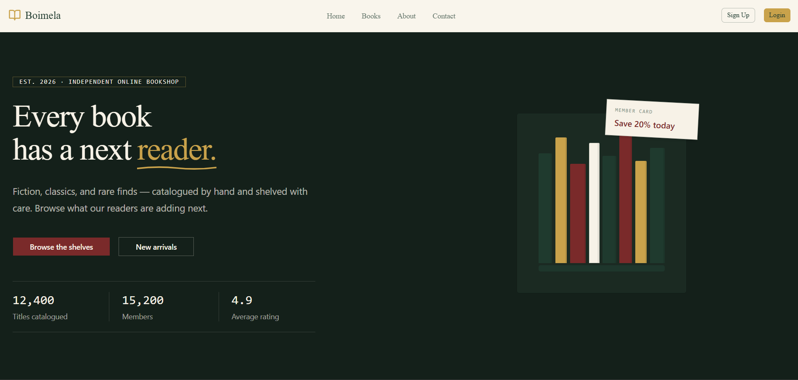

#  BoiMela – Online Bookstore

BoiMela is a modern online bookstore built with **Next.js**, **TypeScript**, **Firebase**, and **Tailwind CSS**. It provides a seamless experience for readers to browse and purchase books while giving administrators full control over book management.

---

## 🌐 Live Demo

> [Click me to visit the site](https://boimela.vercel.app/)

## Home preview




---

## ✨ Features

### 👤 User

- User authentication with Firebase
- Browse all available books
- Search books by title or author
- View detailed book information
- Purchase books
- Responsive design 

### 👨‍💼 Admin


- Add new books
- Update existing books
- Delete books
- Manage book inventory


---

## 🛠️ Tech Stack

### Frontend

- Next.js
- TypeScript
- React
- Tailwind CSS
- Framer Motion

### Backend & Authentication

- Firebase Authentication
- Firebase Firestore

### UI Libraries

- shadcn/ui
- Lucide React
- React Hot Toast

---

## 📁 Folder Structure

```
src
│
├── app
├── components
├── providers
├── lib
├── hooks
├── types
├── utils
└── firebase
```

---

## 🚀 Getting Started

### Clone the repository

```bash
git clone https://github.com/tanvir-22/boimela.git
```

```bash
cd boimela
```

### Install dependencies

```bash
npm install
```

### Create a `.env.local`

```env
NEXT_PUBLIC_FIREBASE_API_KEY=your_api_key

NEXT_PUBLIC_FIREBASE_AUTH_DOMAIN=your_project.firebaseapp.com

NEXT_PUBLIC_FIREBASE_PROJECT_ID=your_project_id

NEXT_PUBLIC_FIREBASE_STORAGE_BUCKET=your_bucket

NEXT_PUBLIC_FIREBASE_MESSAGING_SENDER_ID=your_sender_id

NEXT_PUBLIC_FIREBASE_APP_ID=your_app_id
```

### Run locally

```bash
npm run dev
```

Open

```
http://localhost:3000
```

---


